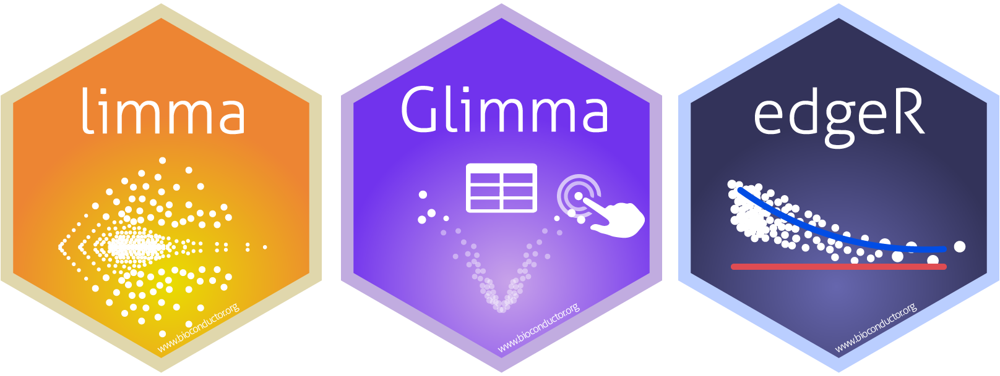

# BioC Asia 2020 workshop: 使用limma、Glimma和edgeR，RNA-seq数据分析易如反掌


## 课程简介




简单且高效地分析RNA测序数据的能力正是Bioconductor的核心优势之一。在获得RNA-seq基因表达矩阵后，通常需要对数据进行预处理、探索性数据分析、差异表达检验以及通路分析，以得到可以帮助进一步实验和验证研究的结果。

 在本次workshop中，我们将通过分析来自小鼠乳腺的RNA测序数据，演示如何使用流行的**edgeR**包载入、整理、过滤和归一化数据，然后用**limma**包的*voom*方法、线性模型和经验贝叶斯调节来评估差异表达并进行基因集检验。通过**Glimma**包，本流程进一步实现了结果的互动探索，便于用户查看特定样本与基因的分析结果。

通过使用这三个Bioconductor包，研究者可以轻松地运行完整的RNA-seq数据分析流程，从原始计数（raw counts）中挖掘出其中蕴含的生物学意义。

### 课前准备

* 了解R语言的语法基础
* 大致了解RNA-seq的原理与目的

### 课程大纲

* 基础背景知识介绍
* RNA-seq数据分析讲解与演示
* 互动答疑环节

## 软件安装与运行

本次workshop所用的资料来自Bioconductor包[RNAseq123](https://bioconductor.org/packages/release/workflows/html/RNAseq123.html)。如果你的电脑上已经装有R（版本需要在3.5.1或以上）与RStudio，并已安装Bioconductor项目3.8或以上版本，则可以使用以下命令在R中下载并安装此包，即可同时安装整个流程中所需要用到的所有R包：

```R
if (!requireNamespace("BiocManager", quietly = TRUE))
    install.packages("BiocManager")

BiocManager::install("RNAseq123")
```

此外，我们也为本次workshop准备了Docker镜像，其中包含R、RStudio与需要用到的所有R包。可以通过以下方式来使用此Docker容器：

* 首先运行以下命令下载并运行Docker镜像：

```sh
docker run -e PASSWORD=自己随便想一个密码 -p 8787:8787 xueyidong/RNAseq123CN
```
* 然后在浏览器里访问https://localhost:8787/ 登陆RStudio，用户名 `rstudio`，密码为上一步里设置的密码。如果你使用的是Windows操作系统，你需要提供本地主机的ip地址，例如`http://191.163.92.108:8787/`，可以在Docker终端中用`docker-machine ip default`命令查询。
